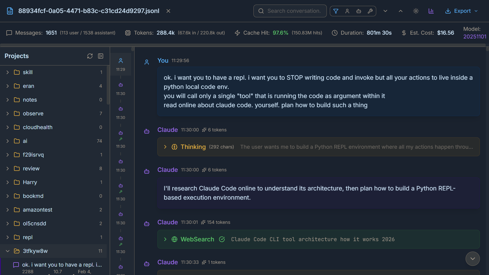

# Claude Conversation Viewer

A beautiful, feature-rich viewer for [Claude Code](https://docs.anthropic.com/en/docs/claude-code) conversation logs.




## Quick Start

```bash
git clone https://github.com/eran-broder/claude-viewer.git
cd claude-viewer
npm install
npm run build
npm start        # Linux/macOS
npm run start:win  # Windows
```

Open http://localhost:3001 in your browser.

## Features

- **Project Browser** - Browse all your Claude Code projects and conversations
- **Real-time Updates** - WebSocket auto-refreshes when new conversations appear
- **Search & Filter** - SQLite-indexed full-text search with highlighting, filter by user/assistant/tools
- **Syntax Highlighting** - Code blocks with language detection and copy button
- **Diff Viewer** - Beautiful diff display for Edit tool operations
- **Thinking Blocks** - Collapsible thinking/reasoning sections
- **Tool Results** - Expandable tool use blocks with inputs and outputs
- **Export** - Export conversations to HTML or Markdown
- **Dark/Light Theme** - Toggle between themes (persisted)
- **Statistics** - Token counts, cache hit rates, duration, estimated cost
- **Keyboard Shortcuts** - Ctrl+F to search, Enter/Shift+Enter to navigate

## How It Works

The viewer reads conversation logs from `~/.claude/projects/` where Claude Code stores JSONL files. It parses these files and displays them in a clean, navigable interface.

**Conversation locations:**
- **Windows**: `C:\Users\<username>\.claude\projects\`
- **macOS/Linux**: `~/.claude/projects/`

## Running

### Production (Recommended)

Single server serves both API and frontend:

```bash
npm run build    # Build frontend
npm start        # Start server (Linux/macOS)
npm run start:win  # Start server (Windows)
```

Runs on http://localhost:3001 (change with `PORT` env var).

### Development

Hot reload for both frontend and backend:

```bash
npm run dev
```

Frontend: http://localhost:5173 (proxies API to backend)

## Keyboard Shortcuts

| Shortcut | Action |
|----------|--------|
| `Ctrl+F` | Focus search |
| `Enter` | Next search result |
| `Shift+Enter` | Previous search result |
| `Escape` | Clear search |

## Tech Stack

- **Frontend**: React 19, TypeScript, Tailwind CSS
- **State**: Zustand
- **Virtualization**: @tanstack/react-virtual
- **Backend**: Express 5 with WebSocket
- **API**: Zod schemas (shared between frontend/backend)
- **Search**: SQLite (sql.js) with automatic indexing
- **Build**: Vite

## Project Structure

```
claude-viewer/
├── src/
│   ├── components/     # React components
│   ├── hooks/          # Custom hooks
│   ├── lib/            # Utilities and parser
│   ├── store/          # Zustand store
│   └── types/          # TypeScript types
├── server/             # Express backend
│   ├── api/            # API routes
│   └── services/       # Search indexing service
├── shared/             # Shared code (frontend + backend)
│   └── schemas/        # Zod schemas for type-safe API
├── dist/               # Built frontend (generated)
└── package.json
```

## License

MIT

## Acknowledgments

Built for use with [Claude Code](https://docs.anthropic.com/en/docs/claude-code) by Anthropic.
